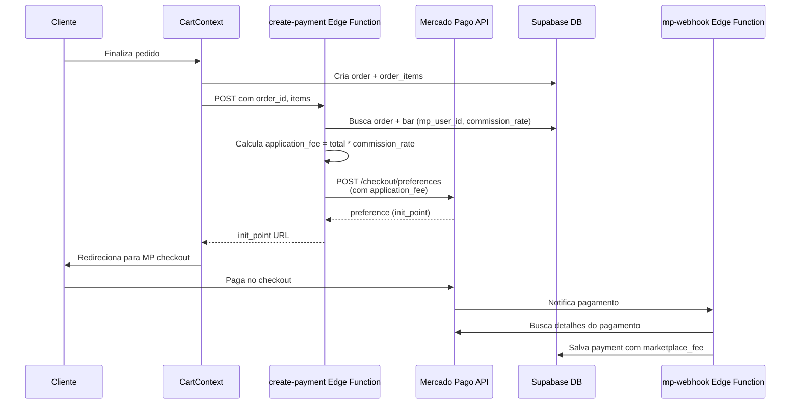

# ✅ Split Payment Mercado Pago - Implementado

## Resumo

Implementação completa do split payment do Mercado Pago de forma simples e segura. A comissão é aplicada automaticamente na criação da preferência de pagamento e os valores são corretamente registrados no banco de dados.

## Mudanças Implementadas

### 1. ✅ `create-payment` Edge Function

**Arquivo**: `supabase/functions/create-payment/index.ts`

**Mudanças**:
- ✅ Busca `commission_rate` do bar junto com `mp_user_id`
- ✅ Calcula `application_fee = total_amount * commission_rate`
- ✅ Adiciona `application_fee` na preferência do Mercado Pago para split automático
- ✅ Valida que `mp_user_id` existe antes de criar preferência
- ✅ Retorna erro claro se bar não estiver conectado ao Mercado Pago
- ✅ Adiciona logs detalhados do split payment

**Código chave**:
```typescript
// Buscar order e bar com commission_rate
const { data: order } = await supabaseClient
  .from("orders")
  .select("*, bars:bar_id (mp_user_id, commission_rate)")
  .eq("id", order_id)
  .single();

// Calcular application_fee
const commissionRate = bar?.commission_rate || 0.05;
const applicationFee = totalAmount * commissionRate;

// Adicionar na preferência
preferenceData.application_fee = parseFloat(applicationFee.toFixed(2));
```

### 2. ✅ `CartContext` Corrigido

**Arquivo**: `src/contexts/CartContext.tsx`

**Mudanças**:
- ✅ Envia `order_id` ao invés de `bar_id`
- ✅ Remove `bar_id` e `commission_rate` do request body (buscado do order)
- ✅ Garante que o order é criado antes de chamar a função
- ✅ Melhora tratamento de erros
- ✅ Corrige leitura do retorno (`init_point` ao invés de `initPoint`)

**Código chave**:
```typescript
// Criar order primeiro
const { data: newOrder } = await client
  .from('orders')
  .insert({ bar_id: barId, total_amount: totalAmount, status: 'pending' })
  .select()
  .single();

// Enviar apenas order_id e items
const requestBody = {
  order_id: newOrder.id,
  items: mpItems,
  // ... outros campos
};
```

### 3. ✅ Validações Implementadas

- ✅ Verifica se `mp_user_id` existe antes de criar preferência
- ✅ Retorna erro claro se bar não estiver conectado ao Mercado Pago
- ✅ Garante que order existe antes de processar pagamento
- ✅ Valida que order_items foram criados

## Fluxo Completo



## Como Funciona o Split

1. **Na criação da preferência**:
   - `application_fee` é calculado: `total_amount * commission_rate`
   - Mercado Pago divide automaticamente: `total = bar_amount + application_fee`
   - Você recebe `application_fee` (sua comissão)
   - O bar recebe `bar_amount` (total - application_fee)

2. **No webhook**:
   - `marketplace_fee` é calculado e salvo no banco
   - Valores são registrados na tabela `payments`

## Validações

- ✅ `create-payment` calcula `application_fee` corretamente
- ✅ `application_fee` é adicionado na preferência do Mercado Pago
- ✅ `CartContext` envia `order_id` corretamente
- ✅ Webhook salva `marketplace_fee` no banco (já estava correto)
- ✅ Bares sem `mp_user_id` retornam erro claro

## Próximos Passos

1. **Conectar bares ao Mercado Pago**:
   - Use o botão "Conectar Mercado Pago" no Admin Portal
   - Isso salva `mp_user_id` e `mp_access_token` no banco

2. **Testar o fluxo**:
   - Criar pedido com bar conectado ao MP
   - Verificar que `application_fee` está na preferência (logs)
   - Completar pagamento
   - Verificar que `marketplace_fee` está salvo no banco

3. **Verificar valores**:
   - Confirmar que `total = bar_amount + marketplace_fee`
   - Verificar que a comissão está correta

## Arquivos Modificados

1. `supabase/functions/create-payment/index.ts` - Adicionado split payment
2. `src/contexts/CartContext.tsx` - Corrigido para enviar `order_id`

## Notas Importantes

- ⚠️ **Bares precisam estar conectados ao Mercado Pago** antes de processar pagamentos
- ⚠️ **O split é automático** - o Mercado Pago divide os valores baseado no `application_fee`
- ⚠️ **A comissão é configurada por bar** - cada bar pode ter uma taxa diferente
- ✅ **O webhook já estava correto** - apenas registra os valores calculados

## Status

✅ **Implementação completa e pronta para uso!**


